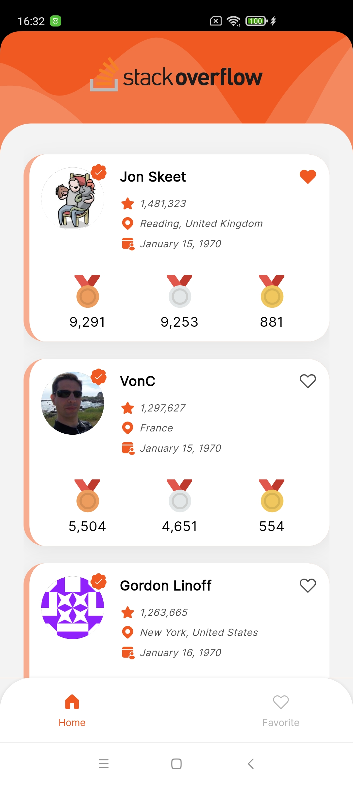
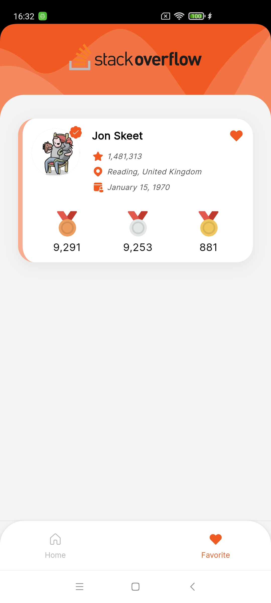
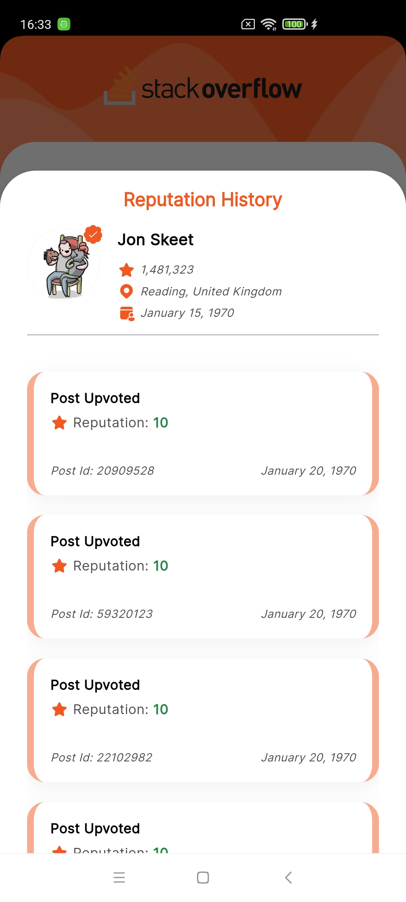

# OIVAN_Assignment

## Technical assignment role for Mobile Developer (Flutter) position at Oivan Vietnam Company Limited

## Submission

Please read the README.md to run the project.

An application allow user to view list of StackOverflow (SOF) user, their reputation history and bookmark their favorite user.

## Getting Started

To run the app, clone the repository and follow the setup instructions. Once setup is complete, run the app.

## Initial Setup

To set up the project, run the following command to activate the project:

```bash
git clone https://github.com/minhducnt/OIVAN_Assignment.git
flutter clean
flutter pub get
dart run flutter_native_splash:create
dart run build_runner clean
dart run build_runner build --delete-conflicting-outputs
```

Once the project is activated, run the following command to run the app:

```bash
flutter run
```

Or you can run by use F5 in Visual Studio Code.

## Features

- **User List**: Users can view a list of StackOverflow users.
- **Bookmark/de-bookmark** Users can bookmark their favorite users.
- **State Management**: GetX is used for efficient state management throughout the application.
- **Local Database**: Hive is used for storing bookmarked users.
- **Internationalization**: Intl is used for internationalization in the application.
- **Network**: Retrofit is used for network calls in the application.

## Technologies Used

- Flutter
- GetX (State Management)
- Retrofit (Network)
- Hive (Local Database)
- Intl (Internationalization)
- Flutter Native Splash (Splash Screen)
- Lazy Loading (Infinite Scroll)
- Shimmer Effect (Loading)
- Lottie (Animation)
- Flutter Launcher Icons (App Icon)
- and other Flutter packages

## Screenshots

- Splash
  

- Home
  

- Bookmark
  

- Reputation History
  
